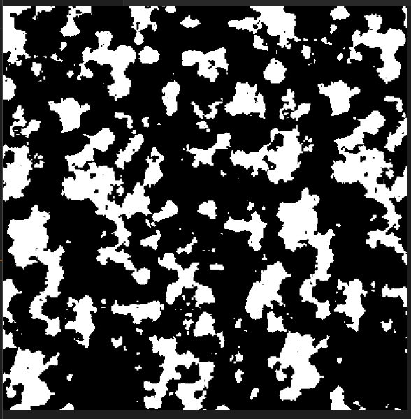
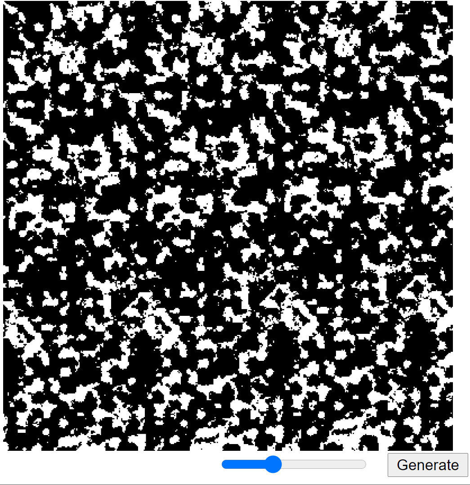

# marble-notebook-pattern-generator
 p5 program the generates the black/white marble covers used in college classes
```
by oran collins
github.com/wisehackermonkey
oranbusiness@gmail.com
20200702

```

# Trying to imulate this book cover pattern

# Results



-----
# Dev log
# WORKS! v1

# added slider and generate button

